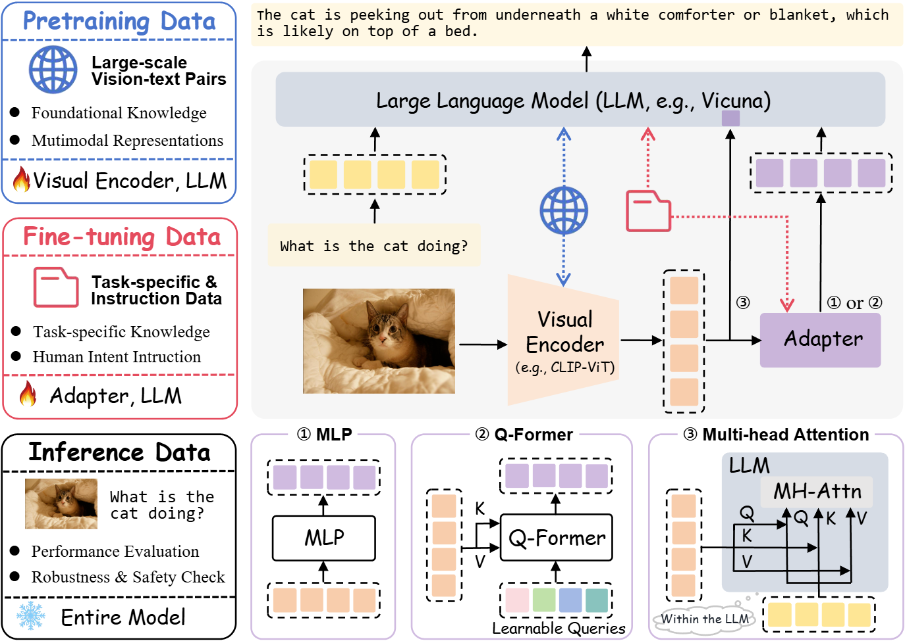
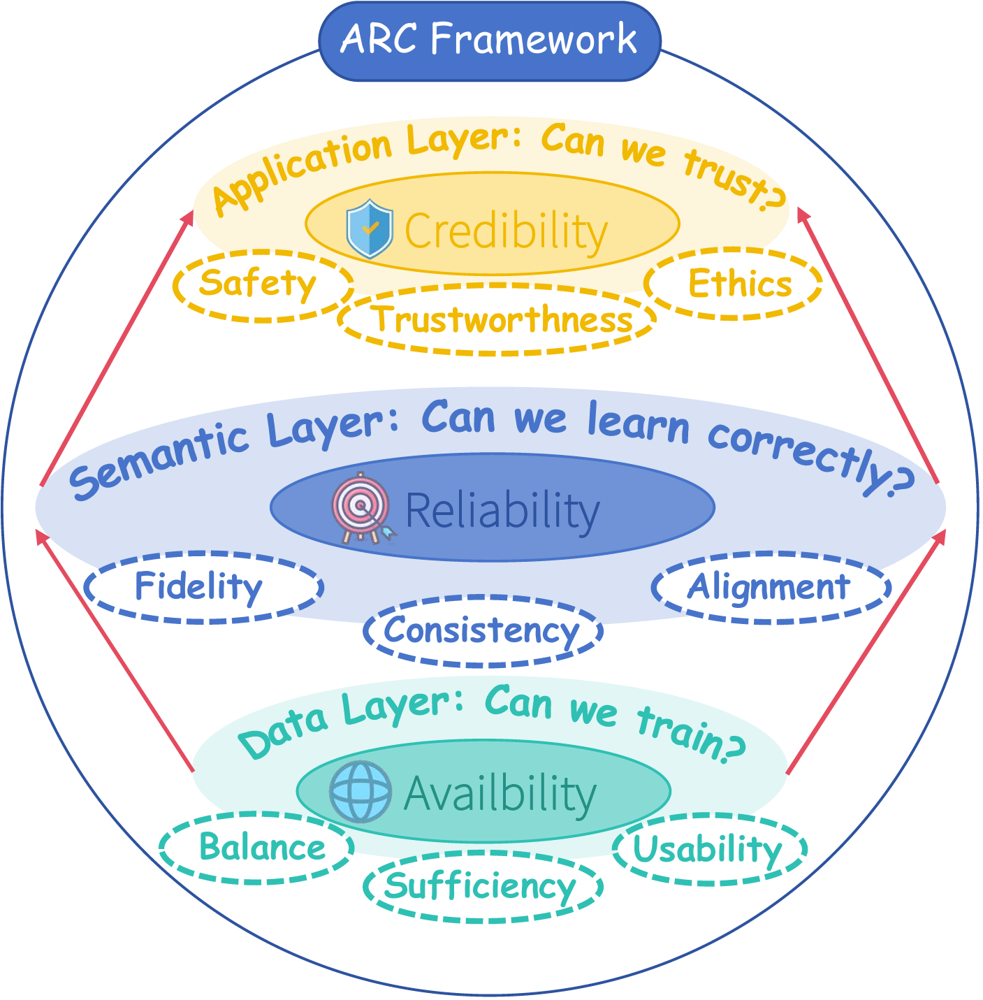
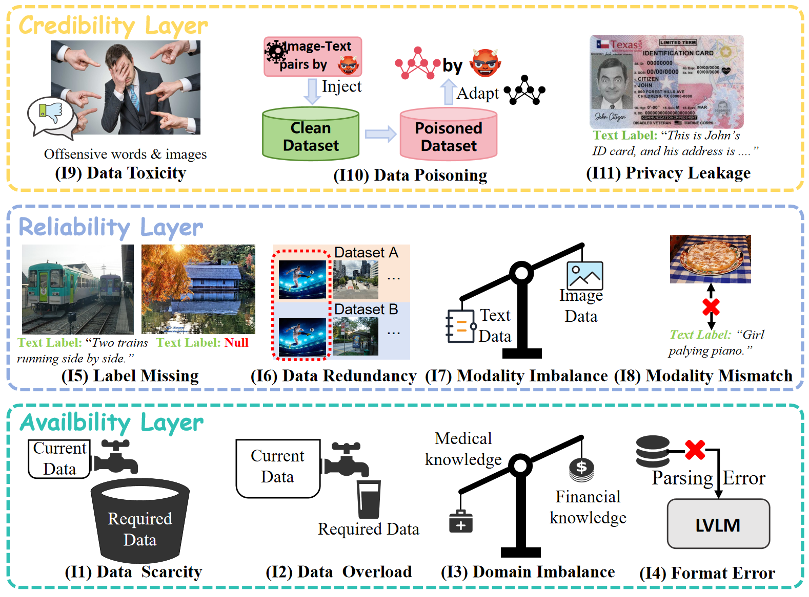
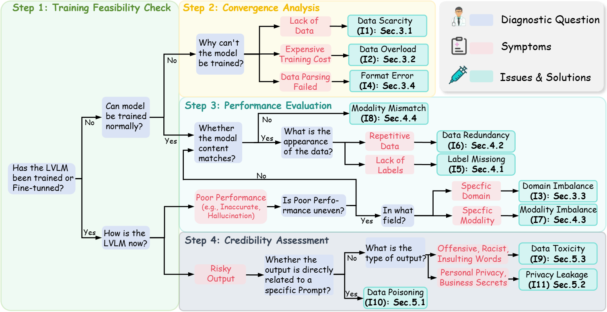

<h1> ARC: Data Quality for Large Vision–Language Models</h1>

  *A living roadmap for data quality in LVLMs — taxonomy, diagnosis, and curated resources.*


<!-- [](LICENSE) -->

This repository accompanies the survey **“Data Quality Management for Large Vision–Language Models: Issues, Techniques, and Prospects.”**  
We organize the materials into four parts:

- [1. Introduction](#1-introduction)  
- [2. ARC Framework and Data Quality Issues](#2-arc-framework-and-data-quality-issues)  
- [3. Diagnosis Framework](#3-diagnosis-framework)  
- [4. Relevant Papers](#4-relevant-papers)  

> We will continuously maintain this repo with newly published papers, diagrams, and practical checklists. If you find missing papers or have better categorizations, feel free to let us know!


---

## 1. Introduction

Large vision–language models (LVLMs) rely on different types of data throughout their lifecycle, and each stage plays a distinct role:

- **Pre-training Data**  
  Large-scale image–text pairs provide the *foundational multimodal knowledge* and *representation ability* of LVLMs. At this stage, corpora such as LAION or Conceptual Captions supply broad coverage across domains, enabling the model to converge and generalize.

- **Fine-tuning Data**  
  Task-specific and instruction data align LVLMs with *human intent* and *downstream requirements*. Through targeted adaptation (e.g., VQA, captioning, grounding), models become capable of precise reasoning and controllable interaction.

- **Inference Data**  
  Real-world inputs—often an image with a natural language query—are used to *evaluate model performance* and *test robustness and safety*. Inference data act as the final check before deployment, revealing whether the model’s learned knowledge transfers reliably.

**Without high-quality data at each stage, LVLMs cannot achieve stable, safe, and trustworthy performance.**


<p align="center">
  
  <!-- <br><em>Figure 1. LVLM lifecycle stages (pre-training → adaptation → inference) motivating ARC (Availability / Reliability / Credibility).</em> -->
</p>


---

## 2. ARC Framework and Data Quality Issues

The **ARC framework** provides a unified lens to analyze and diagnose data quality issues in large vision–language models (LVLMs).  It organizes diverse challenges into **three interdependent layers**, each addressing a fundamental question in the LVLM lifecycle:

- **Availability (Data Layer – *Can we train?*)** Focuses on whether sufficient, balanced, and usable multimodal corpora exist. At this layer, data issues mainly relate to the *scale and distribution* of corpora, such as whether there is too little, too much, or uneven coverage across domains.

- **Reliability (Semantic Layer – *Can we learn correctly?*)** Concerns the semantic faithfulness and cross-modal consistency of data once ingested. This layer emphasizes *modality quality*—for instance, whether annotations are missing, redundant, or poorly aligned—which directly affects how models capture and integrate semantic signals.

- **Credibility (Application Layer – *Can we trust?*)** Governs the ethical soundness, safety, and societal trustworthiness of data. Even when data are sufficient and reliable, risks such as *toxic content, poisoning, or privacy leakage* may undermine responsible deployment in sensitive domains.


<p align="center">
  
</p>

**Availability ensures existence, Reliability ensures correctness, and Credibility ensures trust**.  By mapping concrete issues into these layers, ARC functions not only as a **taxonomy** but also as a **diagnostic tool**, guiding practitioners from observed LVLM failures back to their root causes in data. 

Based on the ARC framework, we categorize **11 representative data issues** across the three layers, each reflecting distinct challenges in terms of availability, reliability, and credibility.


<p align="center">
  
</p>


## 3. Diagnosis Framework

This diagnostic framework translates the ARC taxonomy into a **step-by-step troubleshooting process**.  Starting from whether the LVLM can be trained, it progressively examines training stability, performance distribution, and output safety.  
By linking observable symptoms (e.g., training failure, uneven accuracy, risky outputs) to specific data flaws, it helps practitioners **trace root causes** and select targeted remedies.

<p align="center">
  
</p>


## 4. Relevant Papers

<details><summary><strong>Availability-Oriented Papers Table (click to expand)</strong></summary>

This table lists works primarily addressing data **Availability** issues: scarcity, overload (low-signal bloat), domain imbalance, format / integrity errors, label absence, and redundancy / duplication.

<!--
Columns:
- No. : incremental index
- Reference : paper title (hyperlinked) + optional code link
- Pub.Year : publication year
- Publication : venue (conf./journal/arXiv)
- Data Issues : specific Availability sub-issues
Add new rows at the end; keep numbering sequential. You can later re-order if needed.
-->

| No. | Reference | Pub.Year | Publication | Data Issues | Methods |
|-----|-----------|----------|-------------|-------------|---------|
| 1 | [Microsoft COCO: Common Objects in Context](https://arxiv.org/abs/1405.0312) | 2014 | ECCV / arXiv | Data Scarcity | Public dataset collection (general-domain coverage) |
| 2 | [Conceptual Captions (CC3M)](https://aclanthology.org/P18-1238/) | 2018 | ACL | Data Scarcity | Web-scale image–text collection |
| 3 | [Conceptual 12M (CC12M)](https://arxiv.org/abs/2102.08981) | 2021 | arXiv | Data Scarcity | Large-scale web scraping for long-tail coverage |
| 4 | [LAION-400M](https://arxiv.org/abs/2111.02114) | 2021 | arXiv | Data Scarcity | Large-scale web alt-text collection |
| 5 | [LAION-5B](https://arxiv.org/abs/2210.08402) | 2022 | NeurIPS Datasets & Benchmarks | Data Scarcity | Billion-scale open dataset curation |
| 6 | [YFCC100M](https://arxiv.org/abs/1503.01817) | 2015/2016 | arXiv / CACM | Data Scarcity | Large-scale multimedia collection (photos + metadata) |
| 7 | [SBU Captioned Photo Dataset (Im2Text)](https://papers.nips.cc/paper/4470-im2text-describing-images-using-1-million-captioned-photographs) | 2011 | NeurIPS | Data Scarcity | Early web-scale caption collection |
| 8 | [WebVid-10M](https://arxiv.org/abs/2104.00650) | 2021 | arXiv (ICCV’21 context) | Data Scarcity | Large-scale video–text pair collection |
| 9 | [LLaVA: Visual Instruction Tuning](https://arxiv.org/abs/2304.08485) | 2023 | arXiv | Data Scarcity | Data synthesis with GPT-4 generated instruction data |
| 10 | [ShareGPT4V](https://www.ecva.net/papers/eccv_2024/papers_ECCV/papers/02629.pdf) | 2024 | ECCV | Data Scarcity | Data synthesis for high-quality captions and better alignment |
| 11 | [LISA: Reasoning Segmentation via LLM](https://arxiv.org/abs/2308.00692) | 2023 | arXiv | Data Scarcity | Data synthesis for task-specific supervision (reasoning segmentation) |
| 12 | [Synth²: Boosting Visual-Language Models with Synthetic Captions and Image Embeddings](https://arxiv.org/abs/2403.07750) | 2024 | arXiv | Data Scarcity | Data synthesis via LLM-generated captions + embedding-level augmentation |
| 13 | [Enhanced Visual Instruction Tuning with Synthesized Data](https://aclanthology.org/2024.findings-acl.864.pdf) | 2024 | Findings of ACL | Data Scarcity | Data synthesis using ChatGPT + text-to-image models for multi-round instruction data |
| 14 | [Unicorn: Text-only Data Synthesis for VLM Training](https://arxiv.org/abs/2503.22655) | 2025 | arXiv | Data Scarcity | Data synthesis with LLM-only captions and instructions (no real images) |
| 15 | [Are We Ready for a Fully Synthetic CLIP Training? (SynthCLIP)](https://openreview.net/forum?id=7DY2Nk9snh) | 2023/2024 | OpenReview | Data Scarcity | Purely synthetic image–text pairs for CLIP training |
| 16 | [Enhancing Vision–Language Compositional Understanding with Multimodal Synthetic Data](https://openaccess.thecvf.com/content/CVPR2025/papers/Li_Enhancing_Vision-Language_Compositional_Understanding_with_Multimodal_Synthetic_Data_CVPR_2025_paper.pdf) | 2025 | CVPR | Data Scarcity | Data synthesis via image editing / variation for compositional generalization |
| 17 | [Language Models are Few-Shot Learners](https://arxiv.org/abs/2005.14165) | 2020 | NeurIPS | Data Overload  | Classifier-based text filtering |
| 18 | [What’s In My Big Data?](https://arxiv.org/abs/2310.20707) | 2023 | arXiv | Data Overload  | Dataset auditing, error/irrelevance detection |
| 19 | [Wukong: A 100 Million Large-scale Chinese Cross-modal Benchmark](https://arxiv.org/abs/2202.06767) | 2022 | NeurIPS | Data Overload | Large-scale multilingual text filtering |
| 20 | [The Pile: An 800GB Dataset of Diverse Text for Language Modeling](https://arxiv.org/abs/2101.00027) | 2020 | arXiv | Data Overload  | Dataset mixture + quality filtering |
| 21 | [Exploring the Limits of Transfer Learning with a Unified Text-to-Text Transformer](https://jmlr.org/papers/v21/20-074.html) | 2020 | JMLR | Data Overload  | Pretraining with curated text corpora |
| 22 | [Quality Assessment Metrics for Edge Detection and Edge-based Image Segmentation](https://doi.org/10.1002/ima.22210) | 2018 | International Journal of Imaging Systems and Technology (Wiley) | Data Overload  | Edge-based quality assessment |
| 23 | [Objective Image Quality Assessment of Texture Compression](https://doi.org/10.1111/cgf.13322) | 2018 | Computer Graphics Forum | Data Overload  | Texture analysis for objective IQA |
| 24 | [An Efficient Statistical Method for Image Noise Level Estimation](https://openaccess.thecvf.com/content_iccv_2015/html/Chen_An_Efficient_Statistical_ICCV_2015_paper.html) | 2015 | ICCV | Data Overload | Automated noise-level estimation |
| 25 | [ Concept-skill transferability-based data selection for large vision-language models.](https://arxiv.org/abs/2406.02900) | 2024 | EMNLP | Data Overload | Coreset-based method — selects representative samples approximating dataset structure |
| 26 | [Prism: Self-pruning intrinsic selection method for training-free multimodal data selection.](https://arxiv.org/abs/2502.08976) | 2025 | CVPR | Data Overload | Coreset-based method: image-driven subset construction |
| 27 | [Less is more: High-value data selection for visual instruction tuning](https://arxiv.org/abs/2403.09559) | 2024 | arXiv | Data Overload | Gradient-based method — selects samples with gradient similarity for balanced informativeness |
| 28 | [ICONS: Influence Consensus for Vision-Language Data Selection](https://arxiv.org/abs/2501.00654) | 2024 | arXiv | Data Overload | Gradient-based method — consensus-based influence estimation, guided by validation performance |
| 29 | [Your Vision-Language Model Itself Is a Strong Filter: Towards High-Quality Instruction Tuning with Data Selection](https://arxiv.org/abs/2402.12501) | 2024 | ACL Findings | Data Overload | Loss-based method which prioritizes high-loss samples to improve fine-tuning efficiency |
| 30 | [DoReMi: Optimizing Data Mixtures Speeds Up Language Model Pretraining](https://arxiv.org/abs/2305.10429) | 2023 | NeurIPS | Domain Imbalance | Domain-aware mixture optimization using proxy models |
| 31 | [DataComp: In Search of the Next Generation of Multimodal Datasets](https://arxiv.org/abs/2304.14108) | 2023 | NeurIPS | Domain Imbalance | Benchmark with customizable inclusion policies for balanced dataset creation |
| 32 | [DoGE: Domain Reweighting with Generalization Estimation](https://arxiv.org/abs/2310.15393) | 2024 | ICML | Domain Imbalance | Bi-level optimization to reweight domains based on generalization performance |
| 33 | [Domain-Weighted Batch Sampling for Neural Dependency Parsing](https://aclanthology.org/2024.mwe-1.24/) | 2024 | arXiv | Domain Imbalance | Batch sampling strategy controlling in-domain vs. out-of-domain ratios |
| 34 | [TiKMiX: Take Data Influence into Dynamic Mixture for Language Model Pre-training](https://arxiv.org/pdf/2508.17677v1) | 2025 | arXiv | Domain Imbalance | Dynamic adjustment of data mixture based on model’s evolving preferences |
| 35 | [Missing data imputation: focusing on single imputation](https://doi.org/10.21037/atm.2016.01.16) | 2016 | Annals of Translational Medicine | Format Errors | Statistical single imputation for missing data |
| 36 | [AddrLLM: Address Rewriting via Large Language Model on Nationwide Logistics Data](https://arxiv.org/abs/2411.13584) | 2024 | arXiv | Format Errors | LLM-based address normalization on large-scale logistics data |
| 37 | [Open-FinLLMs: Open Multimodal Large Language Models for Financial Applications](https://arxiv.org/abs/2408.11878) | 2024 | arXiv | Format Errors | Harmonizing textual and chart-based financial data formats |
| 38 | [Conditional Expectation with Regularization for Missing Data Imputation](https://arxiv.org/abs/2302.00911) | 2023 | arXiv | Format Errors | Regularized imputation for incomplete/malformed entries |
| 39 | [Autodcworkflow: LLM-based Data Cleaning Workflow Auto-generation and Benchmark](https://arxiv.org/abs/2412.06724) | 2024 | arXiv | Format Errors | LLM-generated cleaning workflows and benchmarking |
| 40 | [Huatuo-26M: A Large-scale Chinese Medical QA Dataset](https://arxiv.org/abs/2305.01526) | 2023 | arXiv | Format Errors | Cleaning/normalization of large-scale medical QA data |
| 41 | [HoneyBee: A Scalable Modular Framework for Creating Multimodal Oncology Datasets](https://arxiv.org/abs/2405.07460) | 2024 | arXiv | Format Errors | Multimodal oncology dataset creation with standardized formats |


</details>


<details><summary><strong>Reliability-Oriented Papers Table (click to expand)</strong></summary>

This table lists works primarily addressing data **Reliability** issues: label missing, data reduncancy, modality imbalance, modality mismatch.

<!--
Columns:
- No. : incremental index
- Reference : paper title (hyperlinked) + optional code link
- Pub.Year : publication year
- Publication : venue (conf./journal/arXiv)
- Data Issues : specific Availability sub-issues
Add new rows at the end; keep numbering sequential. You can later re-order if needed.
-->

| No. | Reference | Pub.Year | Publication | Data Issues | Methods |
|-----|-----------|----------|-------------|-------------|---------|
| 1 | [Deep Clustering for Unsupervised Learning of Visual Features](https://arxiv.org/abs/1807.05520) | 2018 | ECCV | Label Missing | k-means clustering for pseudo-label generation on visual features |
| 2 | [Self-Supervised Learning by Cross-Modal Audio-Video Clustering (XDC)](https://arxiv.org/abs/1911.12667) | 2020 | NeurIPS | Label Missing | Cross-modal clustering for audio–visual representations |
| 3 | [Multimodal Semi-Supervised Learning for Text Recognition (SemiMTR)](https://arxiv.org/abs/2205.03873) | 2022 | arXiv | Label Missing | Consistency regularization on multimodal text recognition |
| 4 | [Multiview Pseudo-Labeling for Semi-Supervised Learning from Video](https://openaccess.thecvf.com/content/ICCV2021/html/Xiong_Multiview_Pseudo-Labeling_for_Semi-Supervised_Learning_from_Video_ICCV_2021_paper.html) | 2021 | ICCV | Label Missing | Multi-view pseudo-labeling leveraging complementary video cues |
| 5 | [Cross-Modality Clustering-based Self-Labeling for Multimodal Data Classification](https://arxiv.org/abs/2408.02568) | 2024 | arXiv | Label Missing | Modality-specific clustering with dynamic pseudo-label propagation |
| 6 | [ChatGPT out of the box: Productivity and annotation quality of AI-assisted data labeling](https://www.science.org/doi/10.1126/sciadv.adl2528) | 2023 | Science Advances | Label Missing | LLM-assisted data labeling productivity and quality evaluation |
| 7 | [User-guided cross-domain stance detection with word embeddings](https://dl.acm.org/doi/10.1145/3132847.3132993) | 2017 | CIKM | Label Missing | Early pseudo-labeling with embedding-based cross-domain stance detection |
| 8 | [Pseudo-Labeling with Large Language Models for Multi-label Emotion Classification of French Tweets](https://arxiv.org/abs/2306.10706) | 2023 | arXiv | Label Missing | LLM-based pseudo-labeling for multilingual sentiment analysis |
| 9 | [Large Language Models for Data Annotation and Synthesis: A Survey](https://arxiv.org/abs/2404.06111) | 2024 | arXiv | Label Missing | Survey on LLMs for annotation and synthetic data generation |
| 10 | [Unsupervised Learning of Visual Features by Contrasting Cluster Assignments](https://arxiv.org/abs/2006.09882) | 2021 | NeurIPS | Label Missing | Cluster-based pseudo-labeling inspiring LLM-assisted labeling |
| 11 | [GLPN-LLM: Graph-based Label Propagation with Large Language Models](https://arxiv.org/abs/2305.02585) | 2023 | arXiv | Label Missing | Combines LLM-generated labels with graph propagation |
| 12 | [BLIP-2: Bootstrapping Language-Image Pre-training with Frozen Image Encoders and Large Language Models](https://arxiv.org/abs/2301.12597) | 2023 | arXiv | Label Missing | Multimodal LLM pseudo-labeling for images and text alignment |
| 13 | [Obelics: An open web-scale filtered dataset of interleaved image-text documents](https://arxiv.org/abs/2306.08173) | 2024 | NeurIPS | Data Redundancy | Metadata-based deduplication limiting identical image frequency |
| 14 | [Infimm-webmath-40b: Advancing multimodal pre-training for enhanced mathematical reasoning](https://arxiv.org/abs/2409.12568) | 2024 | arXiv | Data Redundancy | Hash-based deduplication (minHash) for multimodal math data |
| 15 | [On the resemblance and containment of documents](https://doi.org/10.1109/SEQUEN.1997.666900) | 1997 | IEEE Sequences | Data Redundancy | MinHash technique estimating Jaccard similarity for duplicate detection |
| 16 | [Multimodal C4: An open, billion-scale multimodal dataset for common crawl](https://arxiv.org/abs/2209.10642) | 2022 | arXiv | Data Redundancy | pHash-based image deduplication for large-scale multimodal corpora |
| 17 | [FairDeDup: Detecting and Mitigating Vision-Language Fairness Disparities in Semantic Dataset Deduplication](https://openaccess.thecvf.com/content/CVPR2024/html/Slyman_FairDeDup_Detecting_and_Mitigating_Vision-Language_Fairness_Disparities_in_Semantic_Dataset_Deduplication_CVPR_2024_paper.html) | 2024 | CVPR | Data Redundancy | Partition-based deduplication with k-means clustering |
| 18 | [COSMO: COntrastive Streamlined MultimOdal Model with Interleaved Pre-Training](https://arxiv.org/abs/2401.00849) | 2024 | arXiv | Data Redundancy | Partition-based deduplication using multimodal contrastive clustering |
| 19 | [On the de-duplication of laion-2b](https://arxiv.org/abs/2303.12733) | 2023 | arXiv | Data Redundancy | Dimensionality-reduction-based deduplication using CLIP embeddings |
| 20 | [Product Quantization for Nearest Neighbor Search](https://ieeexplore.ieee.org/document/5432202) | 2011 | IEEE TPAMI | Data Redundancy | Product quantization for embedding compression and efficient similarity search |
| 21 | [LLaVA-UHD v2: an MLLM Integrating High-Resolution Feature Pyramid via Hierarchical Window Transformer](https://arxiv.org/abs/2412.13871) | 2024 | arXiv | Modality Imbalance | Representation-level balancing with hierarchical high-resolution features |
| 22 | [Diagnosing and re-learning for balanced multimodal learning](https://eccv2024.ecva.net/) | 2024 | ECCV | Modality Imbalance | Representation-level balancing with modality-aware optimization (OPM) |
| 23 | [Characterizing and overcoming the greedy nature of learning in multi-modal deep neural networks](https://proceedings.mlr.press/v162/wu22i.html) | 2022 | ICML | Modality Imbalance | Greedy learning mitigation by regulating modality contributions |
| 24 | [Calibration & Reconstruction: Deeply Integrated Language for Referring Image Segmentation](https://dl.acm.org/doi/10.1145/3626772.3657775) | 2024 | ICMR | Modality Imbalance | Objective-level balancing via calibration and reconstruction regularization |
| 25 | [Calibrating multimodal learning](https://proceedings.mlr.press/v202/ma23e.html) | 2023 | ICML | Modality Imbalance | Objective-level balancing with statistical regularizers (MBSD) |
| 26 | [INF-LLaVA: Dual-perspective Perception for High-Resolution Multimodal Large Language Model](https://arxiv.org/abs/2407.16198) | 2024 | arXiv | Modality Imbalance | Objective-level balancing with dual-perspective consistency (CML) |
| 27 | [Product Quantization for Nearest Neighbor Search](https://ieeexplore.ieee.org/document/5432202) | 2011 | IEEE TPAMI | Modality Imbalance | Objective-level balancing via unimodal teaching to address modality laziness (UMT) |
| 28 | [Codegen: An open large language model for code with multi-turn program synthesis](https://arxiv.org/abs/2203.13474) | 2022 | arXiv | Modality Mismatch | Caption refinement with contextual and descriptive details (BLIP-2) |
| 29 | [DOGE: Domain Reweighting with Generalization Estimation](https://arxiv.org/abs/2401.00849) | 2024 | ICML | Modality Mismatch | LLMs with structured templates for semantically rich captions (LaCLIP) |
| 30 | [Obelics: An open web-scale filtered dataset of interleaved image-text documents](https://arxiv.org/abs/2306.08173) | 2024 | NeurIPS | Modality Mismatch | Template-based LLM caption enrichment (VeCLIP) |
| 31 | [Improving multimodal datasets with image captioning](https://proceedings.neurips.cc/paper_files/paper/2023/hash/99eaf7f9d62d54adfb9b82f38a4765ee-Abstract-Conference.html) | 2023 | NeurIPS | Modality Mismatch | Specialized GPT-4V captioning for alignment (ShareGPT4V) |
| 32 | [Patch Matters: Training-free Fine-grained Image Caption Enhancement via Local Perception](https://arxiv.org/abs/2504.06666) | 2025 | arXiv | Modality Mismatch | Hierarchical patch-level caption generation with semantic filtering |
| 33 | [FILIP: Fine-grained Interactive Language-Image Pre-training](https://arxiv.org/abs/2111.07783) | 2021 | arXiv | Modality Mismatch | Identifying missing elements and integrating external knowledge (KnowAda) |
| 34 | [Revisiting the adversarial robustness of vision language models: a multimodal perspective](https://arxiv.org/abs/2404.19287) | 2024 | arXiv | Modality Mismatch | Entity-level supervision for enriched captions (EECA) |
| 35 | [Datacomp-lm: In search of the next generation of training sets for language models](https://arxiv.org/abs/2406.11768) | 2024 | NeurIPS | Modality Mismatch | Early low-resolution (224×224) image inputs (CLIP) |
| 36 | [Visual instruction tuning](https://arxiv.org/abs/2304.08485) | 2024 | NeurIPS | Modality Mismatch | Higher-resolution visual inputs for improved object clarity (LLaVA-1.5) |
| 37 | [Monkey: Image resolution and text label are important things for large multi-modal models](https://arxiv.org/abs/2311.06607) | 2023 | arXiv | Modality Mismatch | Multi-stream encoders with very high-resolution inputs (896×1344) |
| 38 | [On-the-fly modulation for balanced multimodal learning](https://ieeexplore.ieee.org/document/10416737) | 2024 | IEEE TPAMI | Modality Mismatch | Additional encoders trained on high-resolution features (Vary) |
| 39 | [Federated Multimodal Learning with Privacy Guarantees](https://ieeexplore.ieee.org/document/10646789) | 2024 | IEEE TPAMI | Modality Mismatch | Hierarchical feature pyramid with multi-scale attention (LLaVA-UHD v2) |
| 40 | [Sieve: Multimodal Dataset Pruning Using Image Captioning Models](https://arxiv.org/abs/2310.02110) | 2024 | arXiv | Modality Mismatch | Dual-cropping with multi-scale fusion (INF-LLaVA) |
| 41 | [Sa-attack: Improving adversarial transferability of vision-language pre-training models via self-augmentation](https://arxiv.org/abs/2312.04913) | 2023 | arXiv | Modality Mismatch | Synthetic image–text augmentation for weak supervision (MixGen) |
| 42 | [Robust contrastive language-image pretraining against data poisoning and backdoor attacks](https://proceedings.neurips.cc/paper_files/paper/2024/hash/9d6e2a89b62d3e2a19c678dfe1ab23df-Abstract-Conference.html) | 2024 | NeurIPS | Modality Mismatch | Bidirectional correction of misaligned pairs (BiCro) |
| 43 | [Data collection and quality challenges in deep learning: A data-centric AI perspective](https://doi.org/10.1007/s00778-023-00787-y) | 2023 | VLDB Journal | Modality Mismatch | Refinement pipeline with positive/negative captions and tags (HQ-CLIP) |


</details>


<details><summary><strong>Credibility-Oriented Papers Table (click to expand)</strong></summary>

This table lists works primarily addressing data **Credibility** issues: data toxicity, data poisoning, privacy leakage.

<!--
Columns:
- No. : incremental index
- Reference : paper title (hyperlinked) + optional code link
- Pub.Year : publication year
- Publication : venue (conf./journal/arXiv)
- Data Issues : specific Availability sub-issues
Add new rows at the end; keep numbering sequential. You can later re-order if needed.
-->

| No. | Reference | Pub.Year | Publication | Data Issues | Methods |
|-----|-----------|----------|-------------|-------------|---------|
| 1 | [Synergizing LLMs with Global Label Propagation for Multimodal Fake News Detection](https://arxiv.org/abs/2406.00488) | 2024 | NeurIPS | Toxicity Filtering | Rule-based filtering & LLM-assisted pseudo-labeling (used as example of bad word list filtering) |
| 2 | [Test-Time Backdoor Attacks on Multimodal Large Language Models](https://openreview.net/forum?id=9Orm76dUuT) | 2024 | OpenReview | Toxicity Filtering | Evaluation of classifier- vs rule-based toxicity detection methods |
| 3 | [Deceiving Google’s Perspective API built for detecting toxic comments](https://arxiv.org/abs/1702.08138) | 2017 | arXiv | Toxicity Filtering | Single-modal toxicity filtering using rule-based & n-gram keyword lists |
| 4 | [Into the LAION’s Den: Investigating Hate in Multimodal Datasets](https://proceedings.neurips.cc/paper_files/paper/2023/hash/42f225509e8263e2043c9d834ccd9a2b-Abstract-Datasets_and_Benchmarks.html) | 2024 | NeurIPS | Toxicity Filtering | CLIP-based NSFW filtering in LAION construction pipeline |
| 5 | [Learn to Explain: Multimodal Reasoning via Thought Chains for Science Question Answering](https://arxiv.org/abs/2209.09513) | 2022 | NeurIPS | Toxicity Filtering | Leveraging CLIP’s feature space for enhanced multimodal toxicity filtering |
| 6 | [The Pile: An 800GB Dataset of Diverse Text for Language Modeling](https://arxiv.org/abs/2101.00027) | 2020 | arXiv | Toxicity Filtering | Classifier-based filtering and keyword-based removal of toxic text |
| 7 | [BuboGPT: Enabling Visual Grounding in Multi-Modal LLMs](https://arxiv.org/abs/2307.08581) | 2023 | arXiv | Toxicity Filtering | Addressing over-filtering bias and underrepresentation in multimodal toxicity filtering |
| 8 | [MixSpeech: Data Augmentation for End-to-End Speech Recognition](https://www.isca-speech.org/archive/interspeech_2019/chung19_interspeech.html) | 2019 | Interspeech | Data Poisoning | Data augmentation against poisoning in speech recognition |
| 9 | [Strong Data Augmentation Sanitizes Poisoning and Backdoor Attacks without an Accuracy Tradeoff](https://ieeexplore.ieee.org/document/9415020) | 2021 | ICASSP | Data Poisoning | Data augmentation to defend poisoning/backdoor attacks |
| 10 | [Quality Assessment of High-Speed Motion Blur Images for Mobile Scanning Systems](https://www.mdpi.com/1424-8220/25/12/3804) | 2024 | Sensors | Data Poisoning | Quality assessment for data filtering against poisoned/noisy images |
| 11 | [GShard: Scaling Giant Models with Conditional Computation and Automatic Sharding](https://arxiv.org/abs/2006.16668) | 2020 | NeurIPS | Data Poisoning | Model scaling framework related to robust training under poisoning |
| 12 | [MLLM-Protector: Ensuring MLLM’s Safety without Hurting Performance](https://arxiv.org/abs/2401.02906) | 2024 | arXiv | Data Poisoning | Defense framework for ensuring safety in multimodal LLMs |
| 13 | [Laion COCO: 600M Synthetic Captions from LAION2B-en](https://laion.ai/blog/laion-coco) | 2022 | LAION Blog | Data Poisoning | Synthetic caption dataset construction to mitigate poisoned data |
| 14 | [Domain-Weighted Batch Sampling for Neural Dependency Parsing](https://aclanthology.org/2024.mwe-1.24/) | 2024 | ACL Workshop (MWE-UD) | Data Poisoning | Balanced sampling to reduce poisoning bias |
| 15 | [Multimodal Adversarial Defense for Vision-Language Models by Leveraging One-To-Many Relationships](https://arxiv.org/abs/2405.18770) | 2024 | arXiv | Data Poisoning | Defense via one-to-many multimodal relationships |
| 16 | [On the De-duplication of LAION-2B](https://arxiv.org/abs/2303.12733) | 2023 | arXiv | Data Poisoning | Deduplication reduces poisoned or malicious duplicate data |
| 17 | [Jailbreaking GPT-4V via Self-Adversarial Attacks with System Prompts](https://arxiv.org/abs/2311.09127) | 2023 | arXiv | Data Poisoning | Self-adversarial jailbreak attack study on GPT-4V |
| 18 | [A Survey on Deep Semi-Supervised Learning](https://ieeexplore.ieee.org/document/9746486) | 2022 | IEEE TKDE | Data Poisoning | Survey of SSL, including robustness against poisoned data |
| 19 | [MiniGPT-4: Enhancing Vision-Language Understanding with Advanced Large Language Models](https://arxiv.org/abs/2304.10592) | 2023 | arXiv | Data Poisoning | Enhancing robustness of MLLMs under poisoned supervision |
| 20 | [Cross-Modality Clustering-based Self-Labeling for Multimodal Data Classification](https://arxiv.org/abs/2408.02568) | 2024 | arXiv | Data Poisoning | Clustering-based pseudo-labeling to resist poisoning |
| 21 | [Quantifying Memorization Across Neural Language Models](https://arxiv.org/abs/2303.04819) | 2023 | arXiv | Privacy Leakage | Showed that duplicate data amplifies memorization, raising privacy attack success rates |
| 22 | [Privacy Distillation: Reducing Re-identification Risk of Multimodal Diffusion Models](https://arxiv.org/abs/2306.01322) | 2023 | arXiv | Privacy Leakage | Generates synthetic data via diffusion + re-ID filtering before retraining |
| 23 | [Calibrating Noise to Sensitivity in Private Data Analysis](https://link.springer.com/chapter/10.1007/11681878_14) | 2006 | TCC (Springer) | Privacy Leakage | Introduced differential privacy framework |
| 24 | [Deep Learning with Differential Privacy](https://doi.org/10.1145/2976749.2978318) | 2016 | ACM CCS | Privacy Leakage | Proposed DP-SGD (gradient clipping + noise injection) |
| 25 | [Safeguarding Data in Multimodal AI: A Differentially Private Approach to CLIP Training](https://arxiv.org/abs/2306.08173) | 2024 | arXiv | Privacy Leakage | Applied per-batch gradient clipping + noise injection to multimodal CLIP (DP-CLIP) |
| 26 | [Machine Unlearning: A Survey](https://arxiv.org/abs/2402.15143) | 2024 | arXiv | Privacy Leakage | Survey of machine unlearning methods for privacy-preserving ML |
| 27 | [MultiDelete: Multimodal Machine Unlearning via Data Deletion](https://arxiv.org/abs/2404.00965) | 2024 | arXiv | Privacy Leakage | Removes unimodal associations through targeted data deletion |
| 28 | [Single Image Unlearning for Multimodal Models](https://arxiv.org/abs/2306.14425) | 2023 | arXiv | Privacy Leakage | Fine-tuning method to unlearn specific images/concepts (SIU) |
| 29 | [MLLMU-Bench: Benchmarking Machine Unlearning in Multimodal Large Language Models](https://arxiv.org/abs/2407.20123) | 2024 | arXiv | Privacy Leakage | Benchmark for evaluating forgetting effectiveness and utility |
| 30 | [Youku-mplug: A 10 million large-scale Chinese video-language dataset for pre-training and benchmarks](https://arxiv.org/abs/2306.04362) | 2023 | arXiv | Privacy Leakage | Pilot framework: adapter-on-adapter FL for task heterogeneity |
| 31 | [Federated Learning of Multimodal Foundation Models](https://neurips.cc/virtual/2023/poster/71665) | 2023 | NeurIPS | Privacy Leakage | CreamFL: representation-level knowledge distillation + contrastive FL |


</details>


### How to Contribute
If you have found the relevant paper, feel free to contact us. You can submit an issue or get in touch with us via email. Thank you.

### Citation

If you find this repository helpful, please refer to our corresponding survey.


```bibtex
@article{yan2025data,
  title={Data Quality Management for Large Vision-Language Models: Issues, Techniques, and Prospects},
  author={Yan, Yichen and Yuan, Zhaoyi and Pan, Jiajun and Tang, Xiu and Yuan, Gongsheng and Gu, Xiaoling and Chen, Jinpeng and Wu, Sai and Chen, Ke and Song, Mingli and others},
  journal={Authorea Preprints},
  year={2025},
  publisher={Authorea}
}

```

++++
