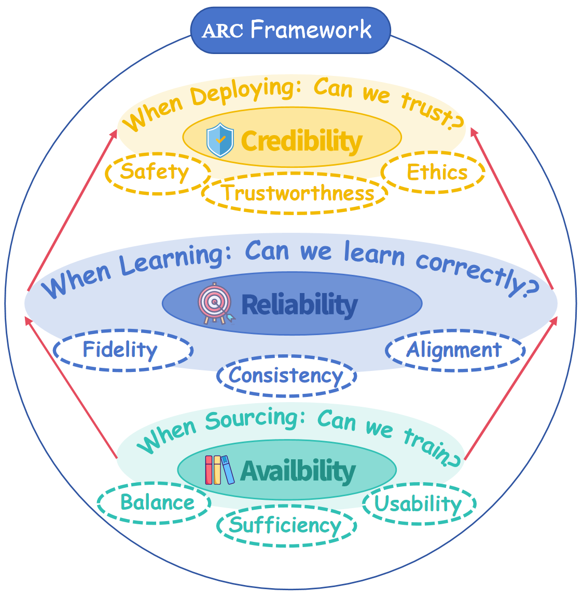

<h1> ARC: Data Quality for Large Vision–Language Models</h1>

  *A living roadmap for data quality in LVLMs — taxonomy, diagnosis, and curated resources.*

<!--  -->

This repository accompanies the survey **“Data Quality Management for Large Vision–Language Models: Issues, Techniques, and Prospects.”**  
We organize the materials into four parts:

- [1. Introduction](#1-introduction)  
- [2. ARC Framework and Data Quality Issues](#2-arc-framework-and-data-quality-issues)  
- [3. Diagnosis Framework](#3-diagnosis-framework)  
- [4. Relevant Papers](#4-relevant-papers)  

> We will continuously maintain this repo with newly published papers, diagrams, and practical checklists. If you find missing papers or have better categorizations, feel free to let us know!

---

## 1. Introduction

Large vision–language models (LVLMs) rely on different types of data throughout their lifecycle, and each stage plays a distinct role:

- **Pre-training Data**  
  Large-scale image–text pairs provide the *foundational multimodal knowledge* and *representation ability* of LVLMs. At this stage, corpora such as LAION or Conceptual Captions supply broad coverage across domains, enabling the model to converge and generalize.

- **Fine-tuning Data**  
  Task-specific and instruction data align LVLMs with *human intent* and *downstream requirements*. Through targeted adaptation (e.g., VQA, captioning, grounding), models become capable of precise reasoning and controllable interaction.

- **Inference Data**  
  Real-world inputs—often an image with a natural language query—are used to *evaluate model performance* and *test robustness and safety*. Inference data act as the final check before deployment, revealing whether the model’s learned knowledge transfers reliably.

**Without high-quality data at each stage, LVLMs cannot achieve stable, safe, and trustworthy performance.**

  
  <!--  <em>Figure 1. LVLM lifecycle stages (pre-training → adaptation → inference) motivating ARC (Availability / Reliability / Credibility).</em> -->

---

## 2. ARC Framework and Data Quality Issues

The **ARC framework** provides a unified lens to analyze and diagnose data quality issues in large vision–language models (LVLMs).  It organizes diverse challenges into **three interdependent layers**, each addressing a fundamental question in the LVLM lifecycle:

- **Availability (Data Layer – *Can we train?*)** Focuses on whether sufficient, balanced, and usable multimodal corpora exist. At this layer, data issues mainly relate to the *scale and distribution* of corpora, such as whether there is too little, too much, or uneven coverage across domains.

- **Reliability (Semantic Layer – *Can we learn correctly?*)** Concerns the semantic faithfulness and cross-modal consistency of data once ingested. This layer emphasizes *modality quality*—for instance, whether annotations are missing, redundant, or poorly aligned—which directly affects how models capture and integrate semantic signals.

- **Credibility (Application Layer – *Can we trust?*)** Governs the ethical soundness, safety, and societal trustworthiness of data. Even when data are sufficient and reliable, risks such as *toxic content, poisoning, or privacy leakage* may undermine responsible deployment in sensitive domains.

  

**Availability ensures existence, Reliability ensures correctness, and Credibility ensures trust**.  By mapping concrete issues into these layers, ARC functions not only as a **taxonomy** but also as a **diagnostic tool**, guiding practitioners from observed LVLM failures back to their root causes in data. 

Based on the ARC framework, we categorize **11 representative data issues** across the three layers, each reflecting distinct challenges in terms of availability, reliability, and credibility.

  

## 3. Diagnosis Framework

This diagnostic framework translates the ARC taxonomy into a **step-by-step troubleshooting process**.  Starting from whether the LVLM can be trained, it progressively examines training stability, performance distribution, and output safety.  
By linking observable symptoms (e.g., training failure, uneven accuracy, risky outputs) to specific data flaws, it helps practitioners **trace root causes** and select targeted remedies.

  

## 4. Relevant Papers

<strong>Availability-Oriented Papers Table (click to expand)</strong>

This table lists works primarily addressing data **Availability** issues: scarcity, overload (low-signal bloat), domain imbalance, format / integrity errors, label absence, and redundancy / duplication.

<!--
Columns:
- No. : incremental index
- Reference : paper title (hyperlinked) + optional code link
- Pub.Year : publication year
- Publication : venue (conf./journal/arXiv)
- Data Issues : specific Availability sub-issues
Add new rows at the end; keep numbering sequential. You can later re-order if needed.
-->

| No. | Reference | Pub.Year | Publication | Data Issues |
|-----|-----------|----------|-------------|-------------|
| 1 | [DataComp: In search of the next generation of multimodal datasets](https://arxiv.org/abs/2304.14108) | 2023 | arXiv | Overload, Redundancy, Quality Filtering |
| 2 | [DoReMi: Optimizing data mixture for language model pretraining](https://arxiv.org/abs/2305.10429) | 2023 | ICML | Mixture Optimization, Imbalance |
| 3 | [LAION-5B: Large-scale open dataset for CLIP training](https://arxiv.org/abs/2210.08402) | 2022 | NeurIPS Datasets | Scale, Coverage, Scarcity Mitigation |
| 4 | [CC12M: Conceptual 12M](https://arxiv.org/abs/2102.08981) | 2021 | arXiv | Scale, Coverage |
| 5 | [The Pile](https://arxiv.org/abs/2101.00027) | 2021 | arXiv | Mixture Curation, Redundancy Control |
| 6 | [CC3M: Conceptual Captions](https://aclanthology.org/P18-1238/) | 2018 | ACL | Coverage, Weak Supervision (Label Missing) |
| 7 | [Automatic data acquisition for deep learning](https://dl.acm.org/doi/10.14778/3476311.3476333) | 2021 | VLDB | Scarcity, Sampling Strategy |
| 8 | [Curriculum learning for large-scale data (Placeholder)](https://example.com) | YYYY | Venue | Scarcity, Imbalance (placeholder) |
| 9 | [Efficient dataset deduplication via hashing (Placeholder)](https://example.com) | YYYY | Venue | Redundancy |
|10 | [Format validation & corruption detection (Placeholder)](https://example.com) | YYYY | Venue | Format Error Detection |

### How to Contribute

- 提交 Issue：提供论文题目、出版年份、所属问题 / 维度标签、简单一句话贡献  
- 提交 PR：编辑 `papers/relevant-papers.md` 或补充图示 / 诊断 checklist  
- 请遵循标签统一规范（例如 `[Availability]`, `[Reliability]`, `[Credibility]`）

### License

MIT for repository content (text, structure). Figures 保持其原始版权／许可。如无特别说明，按 CC BY 4.0。

### Citation

If you find this repository helpful, please refer to our corresponding survey (BibTeX to be added later).

## 4. Relevant Papers

> *Coming up soon.*  
我们将准备一个按主题 / ARC 维度 / 方法类别索引的论文清单（Markdown 格式），每条带标签、摘要、BibTeX、链接。  

---

### How to Contribute

- 提交 Issue：提供论文题目、出版年份、所属问题 / 维度标签、简单一句话贡献  
- 提交 PR：编辑 `papers/relevant-papers.md` 或补充图示 / 诊断 checklist  
- 请遵循标签统一规范（例如 `[Availability]`, `[Reliability]`, `[Credibility]`）

### License

MIT for repository content (text, structure). Figures 保持其原始版权／许可。如无特别说明，按 CC BY 4.0。

### Citation

如果你觉得本仓库对你有帮助，请引用我们对应的 survey（BibTeX 稍后补充）。

